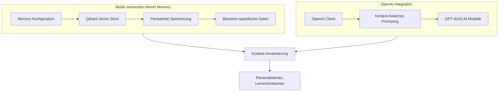
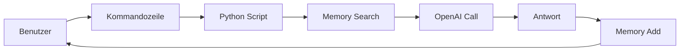
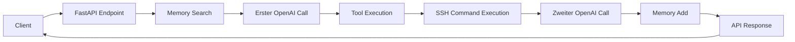

# Vergleichsanalyse: Mem0 Spanish Tutor vs. Mem0 Proxy Server

## 📋 Übersicht

### Mem0 Spanish Tutor (`pytutor.py`)
- **Typ**: Spezialisierte Anwendung
- **Zweck**: Personalisierter Sprachunterricht mit kontinuierlichem Gedächtnis
- **Architektur**: Standalone CLI-Anwendung

### Mem0 Proxy Server (`mem0_proxy_server.py`)
- **Typ**: Allgemeiner API-Proxy
- **Zweck**: OpenAI-kompatibler Proxy mit SSH-Tool-Integration
- **Architektur**: FastAPI-Webserver mit asynchroner Verarbeitung

## 🏗️ Architektur-Vergleich

### Gemeinsamkeiten

### Unterschiede

#### Mem0 Spanish Tutor

#### Mem0 Proxy Server

## 🔧 Funktionalitäts-Vergleich

### Mem0 Spanish Tutor
| Funktion | Implementierung | Beschreibung |
|----------|----------------|-------------|
| **Memory Search** | `memory.search()` | Sucht relevante Erinnerungen für aktuelle Frage |
| **Memory Add** | `memory.add()` | Speichert Konversation automatisch |
| **Memory List** | `/memories` Befehl | Zeigt alle gespeicherten Erinnerungen an |
| **Memory Delete** | `/forget` Befehl | Löscht spezifische Erinnerungen |
| **Kontext-Building** | Einfache Verkettung | Build Kontext aus Suchresultaten |
| **Benutzer-Interface** | CLI mit Input/Output | Einfache Textinteraktion |

### Mem0 Proxy Server
| Funktion | Implementierung | Beschreibung |
|----------|----------------|-------------|
| **Memory Search** | `memory.search()` mit Limit 5 | Sucht Top-5 relevante Erinnerungen |
| **Memory Add** | `memory.add()` mit voller Konversation | Speichert User+Assistant Nachrichten |
| **Tool Execution** | SSH Command Execution | Führt Befehle auf entfernten Servern aus |
| **SSH Connection Pool** | AsyncSSH mit Pooling | Verwaltet SSH-Verbindungen effizient |
| **Target Detection** | `detect_target_server()` | Erkennt Zielserver basierend auf Befehl |
| **API Interface** | FastAPI mit `/v1/chat/completions` | Vollständige OpenAI-API Kompatibilität |

## 🚀 Technische Unterschiede

### Mem0 Spanish Tutor
- **Synchron**: Blockierende Operationen
- **Einfach**: Keine asynchrone Verarbeitung
- **Lokale Ausführung**: Nur auf lokalem System
- **Kein Tooling**: Keine SSH oder externe Befehle
- **Minimaler Kontext**: Einfache Suchresultat-Verkettung

### Mem0 Proxy Server
- **Asynchron**: Vollständig async mit asyncio
- **Komplex**: Multi-Step Tool-Execution Pipeline
- **Distributed**: SSH-Execution auf mehreren Servern
- **Erweitertes Tooling**: Bash, ls, cat Befehle via SSH
- **Rich Kontext**: Strukturierte Memory-Integration

## 🔄 Ablauf-Vergleich

### Spanish Tutor Ablauf
1. Benutzereingabe empfangen
2. Relevante Memories suchen
3. OpenAI mit Kontext anfragen
4. Antwort anzeigen
5. Konversation speichern

### Proxy Server Ablauf
1. API Request empfangen
2. Relevante Memories suchen (Limit 5)
3. **Erster OpenAI Call** mit Kontext
4. **Tool Calls identifizieren und ausführen**
5. **SSH Befehle auf Zielservern ausführen**
6. **Zweiter OpenAI Call** mit Tool-Results
7. Konversation speichern (User + Assistant)
8. API Response zurückgeben

## 🎯 Use-Cases

### Mem0 Spanish Tutor
- 🤖 **Personalisiertes Sprachenlernen**
- 📚 **Kontinuierlicher Wissensaufbau**
- 👤 **Einzelbenutzer-Anwendung**
- 💻 **Lokale CLI-Nutzung**

### Mem0 Proxy Server
- 🌐 **API-Gateway für multiple Clients**
- ⚡ **Automatisierte Infrastruktur-Steuerung**
- 🔧 **Tool-Execution über SSH**
- 🏢 **Enterprise-Grade Architektur**
- 🤝 **Multi-User Support**

## 📊 Performance & Skalierung

| Aspekt | Spanish Tutor | Proxy Server |
|--------|---------------|-------------|
| **Nutzung** | Single-User | Multi-User |
| **Skalierbarkeit** | Begrenzt | Hoch (async) |
| **Netzwerk** | Kein | SSH + HTTP |
| **Resource Usage** | Niedrig | Mittel-Hoch |
| **Complexity** | Einfach | Komplex |

## 🔐 Sicherheit

### Spanish Tutor
- 🔓 **Lokale Ausführung**
- 🛡️ **Eingeschränkte Funktionen**
- 🔒 **Keine externen Zugriffe**

### Proxy Server
- 🔐 **SSH Key Authentication**
- 🌐 **Netzwerk-Exposure** (Port 8765)
- ⚠️ **Sicherheitsrisiken durch Tool-Execution**
- 🛡️ **Connection Pooling mit Timeouts**

## 💡 Entwicklungs-Paradigmen

### Spanish Tutor
- **Minimalistisch**: Fokussiert auf Core-Funktionalität
- **Educational**: Einfach zu verstehen und modifizieren
- **Standalone**: Keine Abhängigkeiten zu anderen Services

### Proxy Server
- **Enterprise**: Production-ready Architektur
- **Erweiterbar**: Modularer Aufbau für neue Features
- **Integration**: Verbindet multiple Systeme
- **Robust**: Umfangreiche Fehlerbehandlung

## 🎓 Lernkurve & Wartbarkeit

### Spanish Tutor
- ✅ **Einfach zu verstehen**
- ✅ **Geringe Wartungskosten**
- ✅ **Ideal für Prototypen**

### Proxy Server
- 📚 **Steiler Lernkurve** (async, SSH, FastAPI)
- 🔧 **Höhere Wartungskosten**
- 🏭 **Production-Grade Code**

## 🔮 Zukunftsfähigkeit

### Spanish Tutor
- **Einfache Erweiterungen**: Weitere Sprachunterrichts-Features
- **UI-Integration**: Web- oder Mobile-Frontend
- **Offline-Fähigkeit**: Lokale Modelle integration

### Proxy Server
- **Plugin-System**: Erweiterbare Tool-Integration
- **Monitoring**: Healthchecks, Metrics, Logging
- **Authentication**: API Keys, Rate Limiting
- **Cluster-Support**: Multiple Server, Load Balancing

## 📈 Fazit

Beide Skripte demonstrieren die Power von Mem0 Memory-Integration, aber mit unterschiedlichen Ansätzen:

- **Spanish Tutor**: Perfekt für **spezialisierte, einfache Anwendungen** mit Fokus auf Benutzerinteraktion
- **Proxy Server**: Ideal für **komplexe, verteilte Systeme** mit Tool-Execution und API-Integration

Der Proxy Server stellt eine evolutionäre Weiterentwicklung dar, die die Mem0-Technologie in enterprise-fähige Architekturen überführt.