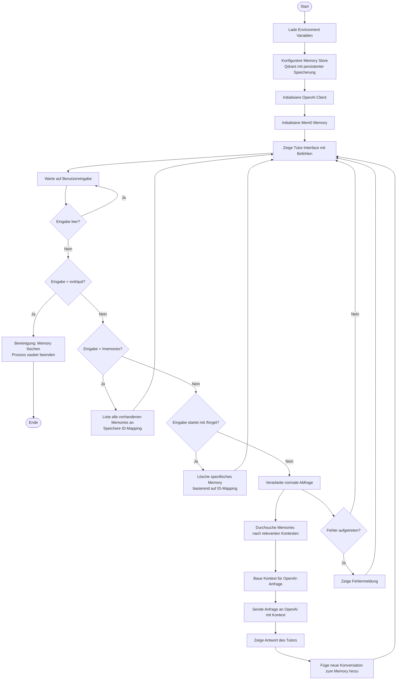

# Mem0 Spanish Tutor - Ablauf Canvas

## 📊 Flussdiagramm des Python-Skripts

## 🏗️ Architektur-Komponenten

### 1. **Memory Layer (Mem0)**
- **Provider**: Qdrant Vector Database
- **Speicherort**: Lokale Datei (`.qdrant_data`)
- **Collection**: `spanish_tutor_session`
- **Persistence**: On-Disk Storage

### 2. **AI Layer (OpenAI)**
- **Model**: GPT-4o
- **Kontext**: Personalisierte Antworten basierend auf Memory-Kontext

### 3. **Benutzerinteraktion**
- **Eingabe**: Freie Texteingabe
- **Spezialbefehle**:
  - `/memories` - Zeige alle gespeicherten Erinnerungen
  - `/forget [nummer]` - Lösche spezifische Erinnerung
  - `exit`/`quit` - Beende das Programm

## 🔄 Ablaufschritte Detail

### A. Initialisierung
1. Environment Variablen laden
2. Qdrant Memory Store konfigurieren
3. OpenAI Client initialisieren
4. Mem0 Memory System starten

### B. Hauptschleife
1. Benutzereingabe empfangen
2. Befehlstyp identifizieren:
   - Memory-Liste anzeigen
   - Memory löschen
   - Normale Abfrage verarbeiten
   - Programm beenden

### C. Abfrageverarbeitung
1. **Search**: Relevante Memories für aktuelle Frage suchen
2. **Context**: Kontext für OpenAI-Anfrage zusammenstellen
3. **Generate**: Personalisierte Antwort generieren
4. **Store**: Neue Konversation ins Memory speichern

### D. Memory-Operationen
- **GET_ALL**: Alle vorhandenen Memories abrufen
- **SEARCH**: Relevante Memories für Query finden
- **ADD**: Neue Konversation speichern
- **DELETE**: Spezifisches Memory entfernen

## 🛡️ Fehlerbehandlung
- Exception Handling für OpenAI-Anfragen
- Gültigkeitsprüfung bei Memory-Operationen
- Saubere Beendigung mit Memory-Cleanup

## 💡 Besondere Merkmale

1. **Automatische Fact Extraction**: Mem0 extrahiert automatisch Kernfakten aus Konversationen
2. **Context Window Optimization**: Nur relevante Memories werden für Kontext verwendet
3. **Persistente Speicherung**: Daten bleiben nach Programmende erhalten
4. **Benutzer-ID basiert**: Sessions sind benutzerspezifisch
5. **ID-Mapping**: Einfache Nummern für komplexe UUIDs

Diese Architektur ermöglicht personalisiertes Lernen mit kontinuierlicher Wissensakkumulation über Sessions hinweg.